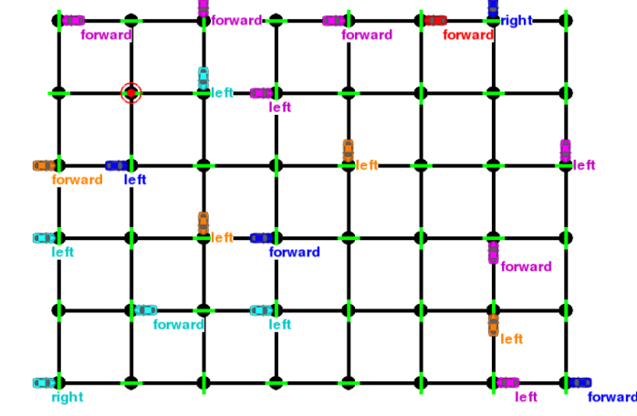

# Train A Smartcab to Drive
Christopher Phillippi

This project forks [Udacity's Machine Learning Nanodegree Smartcab project](https://github.com/udacity/machine-learning/tree/master/projects/smartcab) with my solution, modifying/adding `smartcab/agent.py` and `smartcab/notebookhelpers.py` as well as `README.ipynb`, which you can view [here](https://github.com/ccphillippi/train-a-smartcab/blob/master/README.ipynb).
